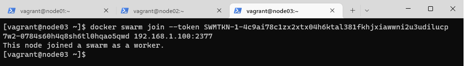

# Criando um Docker Swarm no Vagrant, utilizando SO Rocky Linux 9.

Este projeto tem por objetivo utilizar o *Vagrant* para a criação de 03 máquinas virtuais do SO Rocky Linux 9, utilizando *shell script* para instalações e configurações, com o propósito final de um ambiente de Testes do *Docker Swarm*.

## Pré-requisitos
É necessário executar a instalação dos seguintes softwares:
- [Virtualbox](https://www.virtualbox.org) 
- [Vagrant](https://www.vagrantup.com)

## Pastas e arquivos
Segue abaixo uma descrição das pastas e arquivos contidos no projeto.

### Pastas
- ***scripts:*** pasta utilizada para armazenar scripts do projeto;
- ***images:*** pasta utilizada apenas para armazenar prints utilizadas nesete arquivo README.md.

### Arquivos
- ***Vagrantfile:*** este arquivo contém as configurações necessárias para a criação dos 3 nós no Vagrant;
- ***docker_rl9.sh:*** este *shell script* é utilizado para a configuração e atualização do SO, além da instalação do *Docker/Docker Compose* e adição do usuário vagrant (usuário padrão das VMs do Vagrant) ao grupo *docker*.

## Comandos
Segue abaixo a lista de comandos utilizados.

### Criação dos nós
Para iniciar a criação dos nós, é necessário abrir um terminal dentro da pasta:


 
 Depois executar o comando:
```
vagrant up
```


### Acessando os nós
Para acessar os nós via ssh, execute o comando:
```
vagrant ssh node01
vagrant ssh node02
vagrant ssh node03
```
> Obs.: Pode ser mais produtivo acessar cada nó individualmente por abas.


### Iniciando o Swarm
Para iniciar a execução do *Docker Swarm*, vamos acessar o primeiro nó e executar os comandos necessários.
```
vagrant ssh node01
docker swarm init --advertise-addr 192.168.1.100
```
No retorno do comando, temos as informações de criação de um nó ***Manager*** e o comando com um token que deverá ser utilizado para adicionar os nós ***Worker*** no cluster do *Swarm*.

> Obs.: Foi utilizada a opção  ***--advertise-addr*** pois há mais de uma interface de rede e portanto, é necessário especificar qual interface será utilizada na criação do *cluster*.

Agora, basta acessar os outros nós e adicioná-los ao Swarm para finalizar o cluster.
```
vagrant ssh node02
docker swarm join --token SWMTKN-1-4c9ai78c1zx2xtx04h6ktal381fkhjxiawwni2u3udilucp7w2-0784s60h4q8sh6tl0hqao5qwd 192.168.1.100:2377
```

```
vagrant ssh node03
docker swarm join --token SWMTKN-1-4c9ai78c1zx2xtx04h6ktal381fkhjxiawwni2u3udilucp7w2-0784s60h4q8sh6tl0hqao5qwd 192.168.1.100:2377
```

> Obs.: Não copie o comando daqui pois está com o meu *token*. Copie o comando informado no node01 durante a inicialização do *Swarm*. Além disso, caso tenha alterado os IPs no arquivo *Vagrantfile*, estará no comando o IP que você atribuiu ao node01.

Após adicionar os dois nós ao cluster, podemos verificar no nó *Manager* (node01):
```
docker node ls
```


Pronto! A criação do cluster do Docker Swarm foi finalizada com sucesso!

## Segue abaixo uma lista de comandos úteis na administração do Docker Swarm
### Comandos úteis
Descobrir token para adicionar novo nó (*Manager* e *Worker*) ao *cluster*:
```
docker swarm join-token manager
docker swarm join-token worker
```
Alterar tokens (*Manager* e *Worker*):
```
docker swarm join-token --rotate manager
docker swarm join-token --rotate worker
```
> Obs.: Recomendado fazer a alteração do token de tempos em tempos.

Promover algum nó *Worker* para *Manager*, basta executar os seguintes comandos:
```
docker node promote node02
ou
docker node promote node03
```
Despromover, execute os comandos:
```
docker node demote node02
ou
docker node demote node03
```
Remover um nó do *cluster*:
```
docker swarm leave
```
> Obs.: Se o nó for *Manager*, é necessário acrescentar o parâmetro **-f** ao final do comando para forçar a saída: *docker swarm leave -f*.